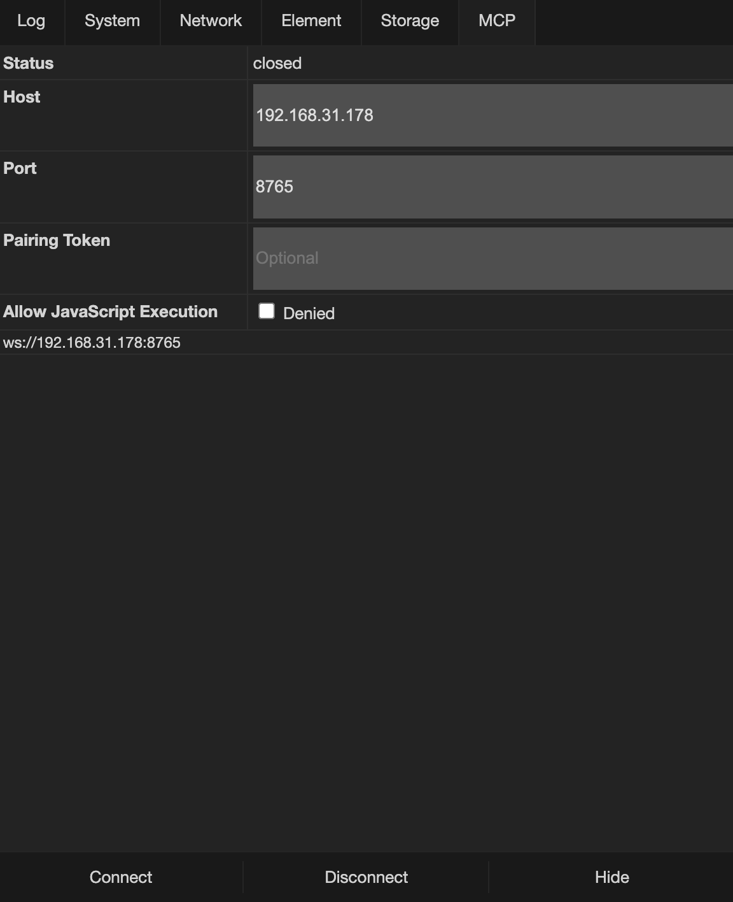
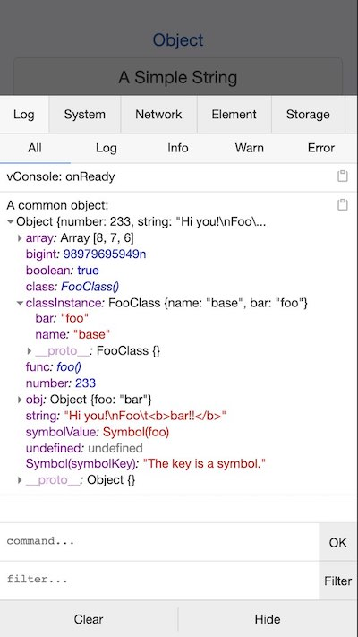
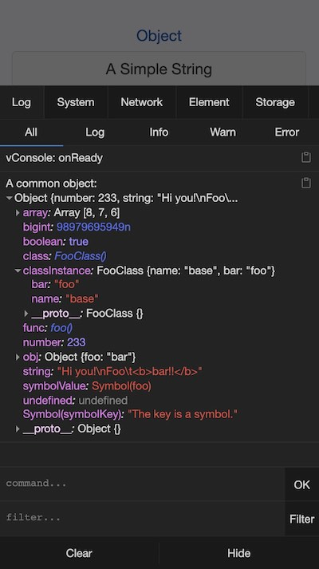
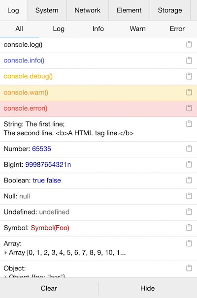
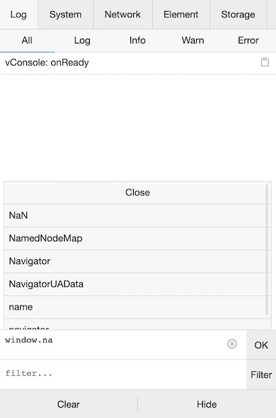
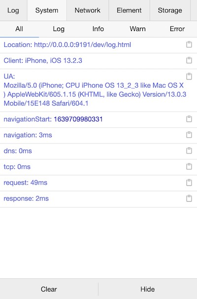
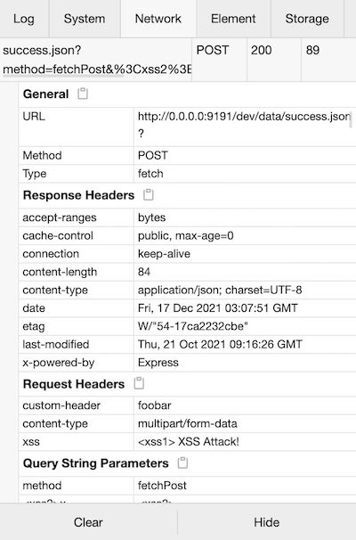
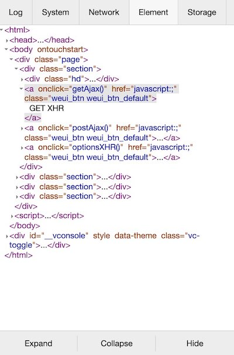
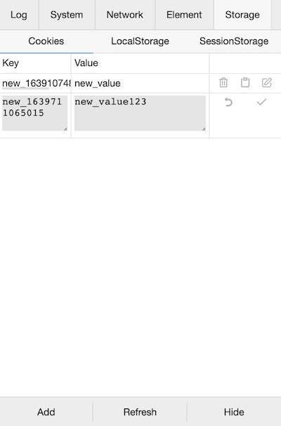

English | [简体中文](./README_CN.md)

vConsole
===

A lightweight, extendable front-end developer tool for mobile web page.

vConsole is framework-free, you can use it in Vue or React or any other framework application.

Now vConsole is the official debugging tool for WeChat Miniprograms.

---

## Features

- Logs: `console.log|info|error|...`
- Network: `XMLHttpRequest`, `Fetch`, `sendBeacon`
- Element: HTML elements tree
- Storage: `Cookies`, `LocalStorage`, `SessionStorage`
- MCP: Let desktop AI debugging tools read page logs and network requests, with optional JavaScript execution after explicit on-device authorization
- Execute JS command manually
- Custom plugins

For details, please see the screenshots below.

---

## Release Notes

Latest version: [](https://www.npmjs.com/package/vconsole)

Detailed release notes for each version are available on [Changelog](./CHANGELOG.md).

---

## Guide

See [Tutorial](./doc/tutorial.md) for more usage details.

For installation, there are 2 primary ways of adding vConsole to a project:

#### Method 1: Using npm (Recommended)

```bash
$ npm install vconsole
```

```javascript
import VConsole from 'vconsole';

const vConsole = new VConsole();
// or init with options
const vConsole = new VConsole({ theme: 'dark' });

// call `console` methods as usual
console.log('Hello world');

// remove it when you finish debugging
vConsole.destroy();
```

#### Method 2: Using CDN in HTML:

```html
<script src="https://unpkg.com/vconsole@latest/dist/vconsole.min.js"></script>
<script>
  // VConsole will be exported to `window.VConsole` by default.
  var vConsole = new window.VConsole();
</script>
```

Available CDN:

- https://unpkg.com/vconsole@latest/dist/vconsole.min.js
- https://cdn.jsdelivr.net/npm/vconsole@latest/dist/vconsole.min.js

---

## Remote Debugging with MCP

The built-in MCP panel connects the page to a vConsole MCP server running on your computer. Once connected, MCP clients such as Codex and Claude Code can read Console logs and Network requests from the current mobile page.



To connect, start the MCP server on the computer, open the `MCP` panel, enter the computer's reachable LAN IP in `Host`, then enter its port and optional pairing token. Tap `Connect`; the page is available to the MCP client when `Status` becomes `open`. Do not use `localhost` as the host when connecting from a phone.

`Allow JavaScript Execution` is denied by default. Enable it only when the AI must operate the page. Authorization granted in the panel lasts only for the current page lifetime and resets after a reload, unless it is explicitly enabled in the initialization options. Executed scripts have the full privileges of the current page context, so use a pairing token and enable this option only on trusted development pages and networks.

HTTPS pages require a secure WebSocket (`wss://`) endpoint. See [Public Properties & Methods](./doc/public_properties_methods.md#vconsolemcp) for programmatic configuration.

---

## Preview

[http://wechatfe.github.io/vconsole/demo.html](http://wechatfe.github.io/vconsole/demo.html)


---

## Screenshots

### Overview

<details>
  <summary>Light theme</summary>


</details>

<details>
  <summary>Dark theme</summary>


</details>

### Log Panel

<details>
  <summary>Log styling</summary>


</details>

<details>
  <summary>Command line</summary>


</details>

### System Panel

<details>
  <summary>Performance info</summary>


</details>

<details>
  <summary>Output logs to different panel</summary>

```javascript
console.log('output to Log panel.')
console.log('[system]', 'output to System panel.')
```
</details>

### Network Panel

<details>
  <summary>Request details</summary>


</details>

### Element Panel

<details>
  <summary>Realtime HTML elements structure</summary>


</details>

### Storage Panel

<details>
  <summary>Add, edit, delete or copy Cookies / LocalStorage / SessionStorage</summary>


</details>

---

## Documentation

vConsole:

 - [Tutorial](./doc/tutorial.md)
 - [Public Properties & Methods](./doc/public_properties_methods.md)
 - [Builtin Plugin: Properties & Methods](./doc/plugin_properties_methods.md)

Custom Plugin:

 - [Plugin: Getting Started](./doc/plugin_getting_started.md)
 - [Plugin: Building a Plugin](./doc/plugin_building_a_plugin.md)
 - [Plugin: Event List](./doc/plugin_event_list.md)

---

## Third-party Plugins

 - [vConsole-sources](https://github.com/WechatFE/vConsole-sources)
 - [vconsole-webpack-plugin](https://github.com/diamont1001/vconsole-webpack-plugin)
 - [vconsole-stats-plugin](https://github.com/smackgg/vConsole-Stats)
 - [vconsole-vue-devtools-plugin](https://github.com/Zippowxk/vue-vconsole-devtools)
 - [vconsole-outputlog-plugin](https://github.com/sunlanda/vconsole-outputlog-plugin)
 - [vite-plugin-vconsole](https://github.com/vadxq/vite-plugin-vconsole)

---

## Feedback

QQ Group: 497430533


---

## License

[The MIT License](./LICENSE)
