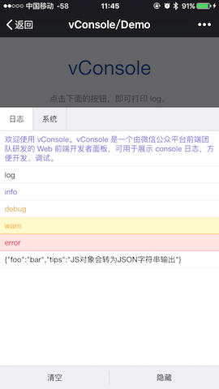

[English](./README.md) | 简体中文

vConsole
==============================
[](https://badge.fury.io/js/vconsole) 

一个轻量、可拓展、针对手机网页的前端开发者调试面板。


## 特性

- 查看 console 日志
- 查看网络请求
- 查看页面 element 结构
- 查看 Cookies 和 localStorage
- 手动执行 JS 命令行
- 自定义插件


## 上手

下载 vConsole 的[最新版本](https://github.com/Tencent/vConsole/releases/latest)。（不要直接下载 dev 分支下的 `dist/vconsole.min.js`）

或者使用 npm 安装：

```
npm install vconsole
```

引入 `dist/vconsole.min.js` 到项目中：

```html
<script src="path/to/vconsole.min.js"></script>
<script>
  // 初始化
  var vConsole = new VConsole();
  console.log('Hello world');
</script>
```

详细使用方法请参阅[使用教程](./doc/tutorial_CN.md)。


## 手机预览


[http://wechatfe.github.io/vconsole/demo.html](http://wechatfe.github.io/vconsole/demo.html)




## 文档


vConsole 本体：

 - [使用教程](./doc/tutorial_CN.md)
 - [公共属性及方法](./doc/public_properties_methods_CN.md)
 - [辅助函数](./doc/helper_functions_CN.md)

插件：

 - [插件：入门](./doc/plugin_getting_started_CN.md)
 - [插件：编写插件](./doc/plugin_building_a_plugin_CN.md)
 - [插件：Event 事件列表](./doc/plugin_event_list_CN.md)


## 插件列表

 - [vConsole-sources](https://github.com/WechatFE/vConsole-sources)
 - [vconsole-webpack-plugin](https://github.com/diamont1001/vconsole-webpack-plugin)


## 更新记录

[CHANGELOG_CN.md](./CHANGELOG_CN.md)


## CDN

- [v3.0.0](https://res.wx.qq.com/mmbizwap/zh_CN/htmledition/js/vconsole/3.0.0/vconsole.min.js) （推荐）
- [v2.5.2](https://res.wx.qq.com/mmbizwap/zh_CN/htmledition/js/vconsole/2.5.2/vconsole.min.js)


## 交流反馈

QQ 群：497430533


## License

[The MIT License](./LICENSE)
