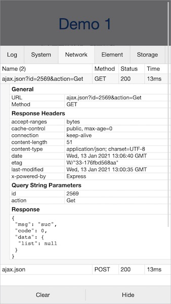

[English](./README.md) | 简体中文

vConsole
==============================
[](https://badge.fury.io/js/vconsole)

一个轻量、可拓展、针对手机网页的前端开发者调试面板。


## 特性

- 查看 console 日志
- 查看网络请求
- 查看页面 element 结构
- 查看 Cookies、localStorage 和 SessionStorage
- 手动执行 JS 命令行
- 自定义插件


## 上手

方法一：使用 npm（推荐）

```bash
$ npm install vconsole
```

Import 并初始化后，即可使用 `console.log` 功能，如 Chrome devtools 上一样。

```javascript
import VConsole from 'vconsole';

const vConsole = new VConsole();
// 或者使用 options 选项初始化
const vConsole = new VConsole({ maxLogNumber: 1000 });

// 接下来即可照常使用 `console` 等方法
console.log('Hello world');

// 结束调试后，可移除掉
vConsole.destroy();
```

方法二：使用 unpkg 的 CDN 直接插入到 HTML

```html
<script src="https://unpkg.com/vconsole/dist/vconsole.min.js"></script>
<script>
  // VConsole 默认会挂载到 `window.VConsole` 上
  var vConsole = new window.VConsole();
</script>
```

详细使用方法请参阅[使用教程](./doc/tutorial_CN.md)。


## 手机预览


[http://wechatfe.github.io/vconsole/demo.html](http://wechatfe.github.io/vconsole/demo.html)

   


## 文档


vConsole 本体：

 - [使用教程](./doc/tutorial_CN.md)
 - [公共属性及方法](./doc/public_properties_methods_CN.md)
 - [辅助函数](./doc/helper_functions_CN.md)

插件：

 - [插件：入门](./doc/plugin_getting_started_CN.md)
 - [插件：编写插件](./doc/plugin_building_a_plugin_CN.md)
 - [插件：Event 事件列表](./doc/plugin_event_list_CN.md)


## 第三方插件列表

 - [vConsole-sources](https://github.com/WechatFE/vConsole-sources)
 - [vconsole-webpack-plugin](https://github.com/diamont1001/vconsole-webpack-plugin)
 - [vconsole-stats-plugin](https://github.com/smackgg/vConsole-Stats)
 - [vconsole-vue-devtools-plugin](https://github.com/Zippowxk/vue-vconsole-devtools)
 - [vconsole-outputlog-plugin](https://github.com/sunlanda/vconsole-outputlog-plugin)
 - [vite-plugin-vconsole](https://github.com/vadxq/vite-plugin-vconsole)

## 更新记录

[CHANGELOG_CN.md](./CHANGELOG_CN.md)


## 交流反馈

QQ 群：497430533


## License

[The MIT License](./LICENSE)
