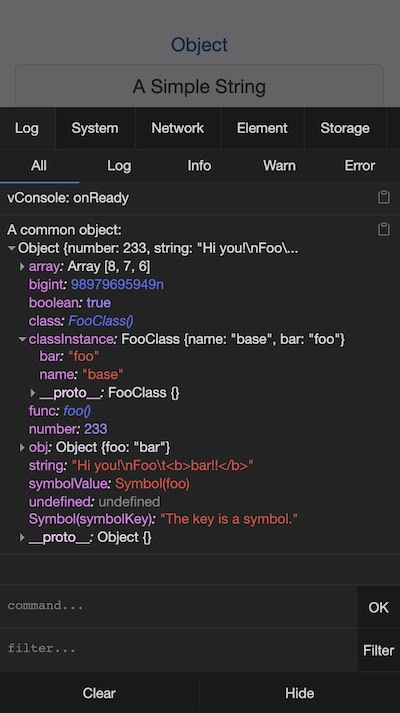
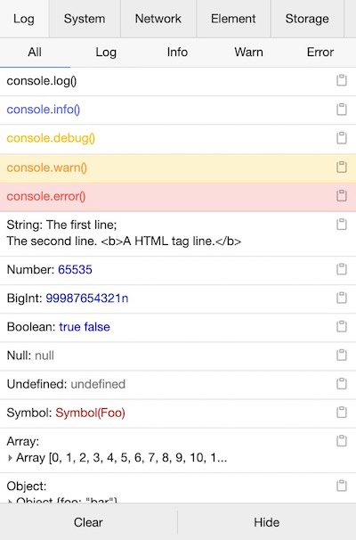
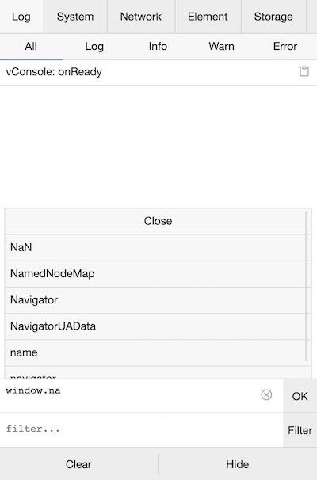
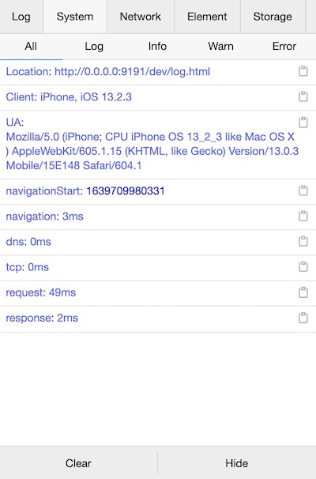
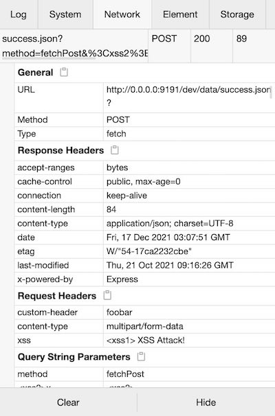
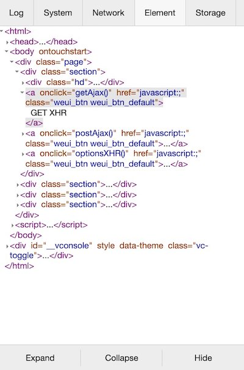
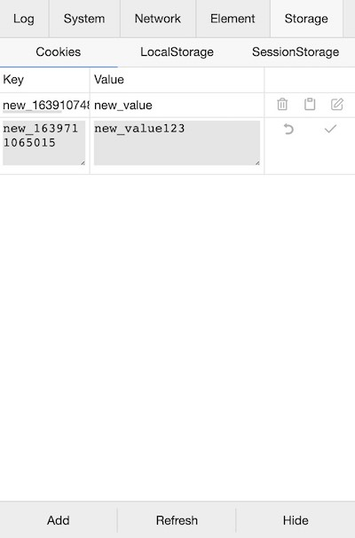

[English](./README.md) | 简体中文

vConsole
===

一个轻量、可拓展、针对手机网页的前端开发者调试面板。

vConsole 是框架无关的，可以在 Vue、React 或其他任何框架中使用。

现在 vConsole 是微信小程序的官方调试工具。

---

## 功能特性

- 日志(Logs)： `console.log|info|error|...`
- 网络(Network)： `XMLHttpRequest`, `Fetch`, `sendBeacon`
- 节点(Element)： HTML 节点树
- 存储(Storage)： `Cookies`, `LocalStorage`, `SessionStorage`
- 手动执行 JS 命令行
- 自定义插件

详情可参考下方的截图。

---

## 版本说明

最新版本： [](https://www.npmjs.com/package/vconsole)

每个版本的详细说明请参阅 [Changelog](./CHANGELOG_CN.md)。

---

## 上手

详细使用方法请参阅[使用教程](./doc/tutorial_CN.md)。

将 vConsole 添加到项目中主要有以下方式：

#### 方法一：使用 npm（推荐）

```bash
$ npm install vconsole
```

Import 并初始化后，即可使用 `console.log` 功能，如 Chrome devtools 上一样。

```javascript
import VConsole from 'vconsole';

const vConsole = new VConsole();
// 或者使用配置参数来初始化，详情见文档
const vConsole = new VConsole({ theme: 'dark' });

// 接下来即可照常使用 `console` 等方法
console.log('Hello world');

// 结束调试后，可移除掉
vConsole.destroy();
```

#### 方法二：使用 CDN 直接插入到 HTML

```html
<script src="https://unpkg.com/vconsole@latest/dist/vconsole.min.js"></script>
<script>
  // VConsole 默认会挂载到 `window.VConsole` 上
  var vConsole = new window.VConsole();
</script>
```

可用的 CDN：

- https://unpkg.com/vconsole@latest/dist/vconsole.min.js
- https://cdn.jsdelivr.net/npm/vconsole@latest/dist/vconsole.min.js

---

## 手机预览

[http://wechatfe.github.io/vconsole/demo.html](http://wechatfe.github.io/vconsole/demo.html)


---

## 截图

### 概览

<details>
  <summary>浅色主题</summary>


</details>

<details>
  <summary>深色主题</summary>


</details>

### Log 面板

<details>
  <summary>Log 样式</summary>


</details>

<details>
  <summary>命令行</summary>


</details>

### System 面板

<details>
  <summary>Performance 信息</summary>


</details>

<details>
  <summary>输入日志到不同的 log 面板</summary>

```javascript
console.log('output to Log panel.')
console.log('[system]', 'output to System panel.')
```
</details>

### Network 面板

<details>
  <summary>请求、回包的详情</summary>


</details>

### Element 面板

<details>
  <summary>查看 HTML 对象结构</summary>


</details>

### Storage 面板

<details>
  <summary>添加、编辑、删除、复制 Cookies / LocalStorage / SessionStorage</summary>


</details>

---

## 文档


vConsole 本体：

 - [使用教程](./doc/tutorial_CN.md)
 - [公共属性及方法](./doc/public_properties_methods_CN.md)
 - [内置插件：属性及方法](./doc/plugin_properties_methods_CN.md)

自定义插件：

 - [插件：入门](./doc/plugin_getting_started_CN.md)
 - [插件：编写插件](./doc/plugin_building_a_plugin_CN.md)
 - [插件：Event 事件列表](./doc/plugin_event_list_CN.md)

---

## 第三方插件列表

 - [vConsole-sources](https://github.com/WechatFE/vConsole-sources)
 - [vconsole-webpack-plugin](https://github.com/diamont1001/vconsole-webpack-plugin)
 - [vconsole-stats-plugin](https://github.com/smackgg/vConsole-Stats)
 - [vconsole-vue-devtools-plugin](https://github.com/Zippowxk/vue-vconsole-devtools)
 - [vconsole-outputlog-plugin](https://github.com/sunlanda/vconsole-outputlog-plugin)
 - [vite-plugin-vconsole](https://github.com/vadxq/vite-plugin-vconsole)

---

## 交流反馈

QQ 群：497430533


---

## License

[The MIT License](./LICENSE)
